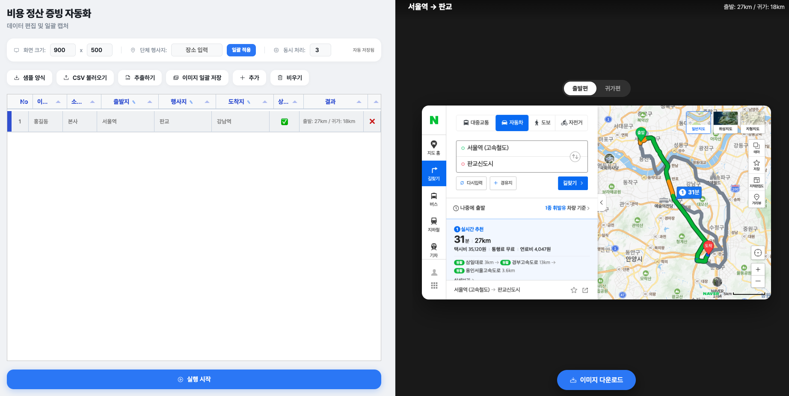

# 🗺️ 비용 정산 증빙 자동화

> **여자친구의 업무 중 비용 정산 시간을 줄여주기 위해 바이브코딩으로 하루 만에 개발된 프로젝트입니다.**

**비용 정산 증빙 자동화**는 네이버 지도를 활용한 대량 자동차 경로 탐색 및 자동 캡처 자동화 솔루션입니다. 엑셀 데이터를 불러와 여러 경로의 최적 거리와 경로 이미지를 한꺼번에 추출하고 관리할 수 있는 데스크톱 어플리케이션입니다.

---

## ✨ 핵심 기능

- 🚀 **병렬 배치 처리**: 여러 경로를 동시에 탐색하여 작업 시간을 획기적으로 단축 (병렬도 설정 가능)
- 📸 **자동 경로 캡처**: 네이버 지도의 '실시간 추천' 자동차 경로를 최적의 뷰포트로 자동 스크린샷 저장
- 📏 **거리 데이터 추출**: 경로 요약 정보에서 최적 거리를 자동으로 추출하여 테이블에 기록
- 📦 **이미지 일괄 저장**: 모든 캡처 성공 이미지를 하나의 ZIP 파일로 한꺼번에 저장
- 📋 **스마트 데이터 편집**: Tabulator 기반의 강력한 그리드 UI로 데이터 직접 수정 및 상태 관리
- 📥 **CSV 연동**: 엑셀(CSV) 파일을 통한 데이터 대량 업로드 및 결과 데이터(BOM 적용) 추출
- 🖥️ **데스크톱 앱**: Electron 기반으로 설계되어 Node.js 설치 없이 독립 실행 가능

---

## 🚀 시작하기

### 1. 사전 요구 사항 (개발용)
- [Node.js](https://nodejs.org/) (v16 이상 권장)

### 2. 설치 및 실행
```bash
# 의존성 패키지 설치
npm install

# Playwright 브라우저 설치
npx playwright install chromium

# 프로그램 실행 (데스크톱 모드)
npm run electron
```
## 🖼️ 미리보기



### 3. 배포용 빌드 (Executable)
```bash
# 맥용(.dmg) 또는 윈도우용(.exe) 빌드
npm run dist
```
*참고: 윈도우용 빌드는 윈도우 PC 환경에서 수행하는 것이 가장 안정적입니다.*

---

## 🛠 사용 방법

1. **데이터 불러오기**: `CSV 불러오기` 버튼을 눌러 양식에 맞춰 작성된 파일을 업로드합니다.
2. **목록 편집**: 출발지, 행사지, 도착지가 비어있다면 테이블에서 직접 클릭하여 수정하거나 `단체 행사지` 일괄 적용 기능을 활용합니다.
3. **설정 조절**: 화면 크기(뷰포트)와 동시 처리 개수를 환경에 맞게 설정합니다.
4. **실행**: `실행 시작` 버튼을 클릭하면 자동화가 시작됩니다.
5. **결과 확인**: 오른쪽 비주얼라이저를 통해 실시간으로 캡처된 이미지를 확인합니다.
6. **내보내기**: 작업 완료 후 `추출하기`로 기록 데이터를, `이미지 일괄 저장`으로 캡처본들을 다운로드합니다.

---

## 📁 프로젝트 구조

- `main.js`: Electron 메인 프로세스 (서버 실행 및 창 관리)
- `server.js`: Express 백엔드 (API 서버)
- `index.html`: 프론트엔드 UI 및 클라이언트 로직
- `batch_process.js`: Playwright 기반의 핵심 스크래핑 엔진
- `dist/`: 빌드된 실행 파일이 저장되는 폴더
- `output/`: 캡처된 결과 이미지가 저장되는 폴더

---

## ⚠️ 주의 사항

- 본 도구는 네이버 지도의 레이아웃 변경에 따라 작동이 멈출 수 있습니다.
- 과도한 병렬도는 네이버 지도 측의 차단이나 시스템 리소스 부족을 야기할 수 있으므로 주의바랍니다. (권장: 3~5)
